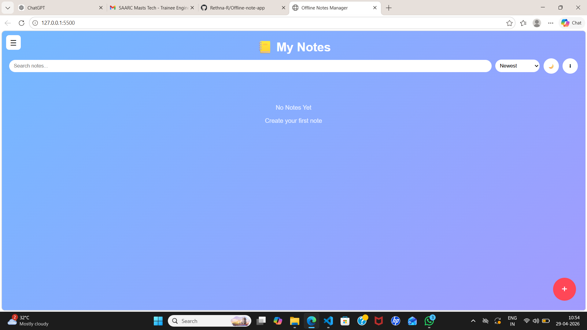
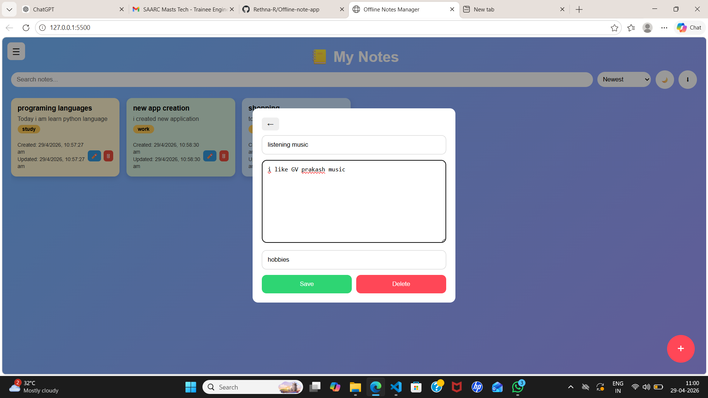
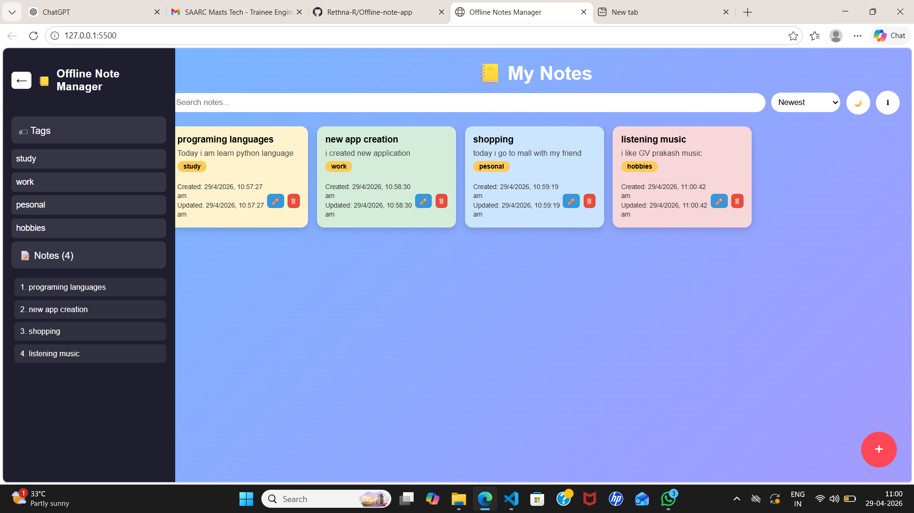
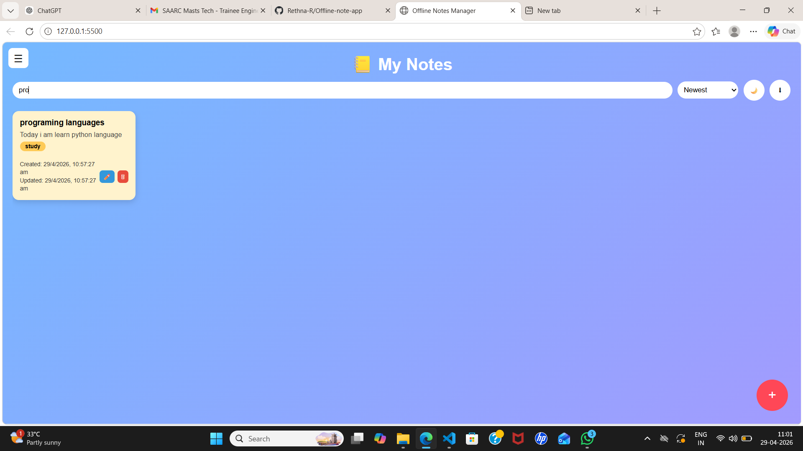
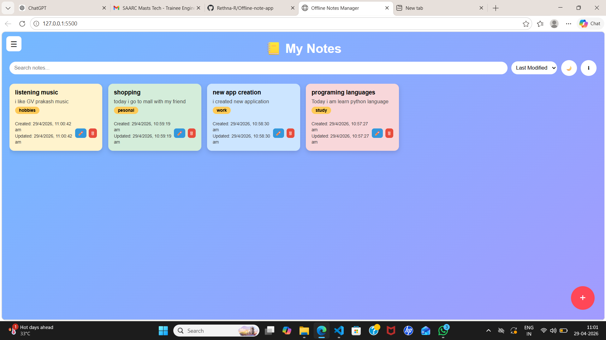
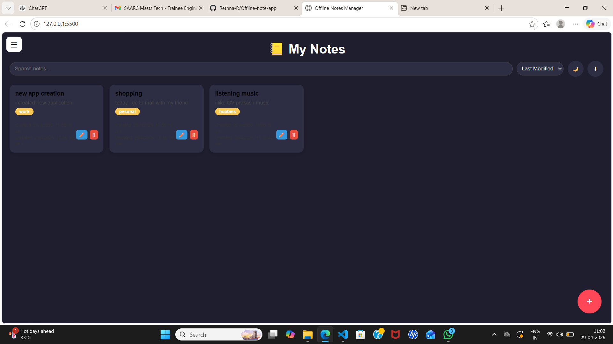

# 📝 Offline Notes Manager (IndexedDB)

## 📌 Overview

This project is a browser-based **offline-first Notes Manager** that allows users to create, edit, delete, and search notes efficiently.

All data is stored locally using **IndexedDB**, ensuring persistence without any backend dependency.

---

## 🚀 Features

### 🧾 Notes Management (CRUD)

* Create notes with:

  * Title
  * Content
  * Tags (comma-separated)
* Edit existing notes
* Delete notes (hard delete implemented)

---

### 💾 Offline Storage (IndexedDB)

* Uses **IndexedDB API** for all data storage
* No usage of localStorage/sessionStorage for primary data
* Structured schema with object store for notes

---

### 🔍 Search & Filter

* Real-time search based on:

  * Title
  * Content
  * Tags
* Dynamic filtering as the user types

---

### 📊 Sorting

* Sort notes by:

  * Created Date
  * Last Modified Date

---

### 🖥️ UI/UX

* Sidebar for notes list
* Main panel for note editor
* Clean and responsive layout

---

## ⭐ Bonus Features

* ⚡ Auto-save with debounce
* 🌙 Dark mode toggle
* 📤 Export notes as JSON

---

## 🛠️ Tech Stack

* HTML5
* CSS3
* JavaScript (Vanilla JS)
* IndexedDB (with/without helper library)

---

## 🗂️ Project Structure

```id="gq4v9r"
├── index.html     # Layout structure
├── style.css      # Styling and responsive design
├── index.js       # Main application logic
├── db.js          # IndexedDB setup and operations
```

---

## 🧠 IndexedDB Design

* Database Name: `notesDB`
* Object Store: `notes`
* Key Path: `id` (auto-increment)

### Fields:

* `id`
* `title`
* `content`
* `tags`
* `createdAt`
* `updatedAt`

---

## ▶️ How to Run

1. Open the project in a browser
2. Or use the live demo link below

---

## 🌐 Live Demo

👉 Run locally by opening index.html in browser.

---

## 📌 Key Implementation Details

* Efficient filtering using JavaScript array methods
* IndexedDB transactions used for all CRUD operations
* Modular code structure for maintainability

---


## 🔮 Future Improvements

* Soft delete with restore option
* Rich text editor
* Sync with cloud backend

## 📸 Screenshots

### 🏠 Home Page


### ➕ Create Note


### 📋 Note List


### 🔍 Search Notes


### 📊 Sorting Feature


### 🌙 Dark Mode + Delete Feature


---

## 🙌 Conclusion

This project demonstrates strong understanding of:

* Offline-first application design
* IndexedDB usage and schema design
* Frontend architecture and user experience

---

## 📧 Contact

Feel free to reach out for any questions or feedback.
